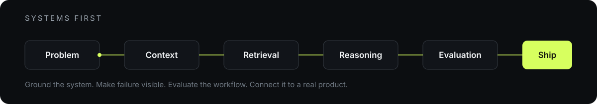

  

  
  
  
  

  

## What I build

I work on applied AI problems where research and engineering have to meet. My focus is not isolated model demos. I care about the complete system around the model: context, retrieval, orchestration, evaluation, failure handling, APIs and product integration.

<table>
<tr>
<td width="50%" valign="top">

### Agentic AI and RAG

Grounded generation, retrieval workflows, structured outputs, tool use, context handling and multi module AI systems.

</td>
<td width="50%" valign="top">

### Speech and Multimodal AI

ASR, speech representation learning, CTC systems, multimodal reasoning and vision based decision workflows.

</td>
</tr>
<tr>
<td width="50%" valign="top">

### Evaluation and Reliability

Failure aware design, explicit evaluation, model behaviour analysis and system level validation.

</td>
<td width="50%" valign="top">

### AI Product Engineering

Backend APIs, data flow, orchestration and the work required to move AI from an experiment into a usable product.

</td>
</tr>
</table>

  

## Featured systems

<table>
<tr>
<td width="50%" valign="top">

### 🧠 [Award Winning GenAI Platform](https://github.com/output9/soft-engg-project-jan-2025-se-Jan-1)

Eight GenAI modules inside one academic software product.

**Role:** AI Engineer on a seven member IIT Madras team  
**Recognition:** Best Software Engineering Project Award  
**Core:** RAG • Gemini • LangChain • ChromaDB • Flask • SQLAlchemy

</td>
<td width="50%" valign="top">

### 🎙️ [Uyghur Automatic Speech Recognition](https://github.com/output9/the-uyghur-voice-cup)

Low resource ASR with multilingual speech representations, custom CTC vocabulary, mixed precision training and decoding experiments.

**Core:** Wav2Vec2 • XLSR • CTC • KenLM • PyTorch • Hugging Face

</td>
</tr>
<tr>
<td width="50%" valign="top">

### 🖼️ [Low Light 4× Super Resolution](https://github.com/output9/denoising-4x-super-resolution-low-light-images)

Image restoration with compact EDSR, augmentation, EMA, SWA, tiled inference and checkpoint ensembling.

**Validation:** 38.7034 dB Y PSNR  
**Core:** PyTorch • EDSR • OpenCV • Albumentations

</td>
<td width="50%" valign="top">

### 🧭 [Low Light Depth Estimation](https://github.com/output9/low-light-depth-estimation)

Dense monocular depth prediction for difficult low light imagery using transfer learning and supervised regression.

**Validation RMSE:** 0.0974 → 0.0730  
**Core:** EfficientNet • U Net • PyTorch • Albumentations

</td>
</tr>
</table>

## Engineering lens

<table>
<tr>
<td width="25%" align="center"><b>Grounding</b> Use the right context</td>
<td width="25%" align="center"><b>Failure</b> Make weak paths visible</td>
<td width="25%" align="center"><b>Evaluation</b> Measure the workflow</td>
<td width="25%" align="center"><b>Product</b> Ship the whole system</td>
</tr>
</table>

## Stack

  

  
  
  
  
  

## Beyond the model

My technical core is Applied AI. I also bring commercial operating context from building and marketing owned digital products, which gives me another lens on users, adoption, feedback loops and measurable outcomes.

  <a href="https://siddharthumathe.com/work"><b>Growth work ↗</b></a>
  &nbsp;&nbsp;•&nbsp;&nbsp;
  <a href="https://siddharthumathe.com/strategic-foresight/"><b>Strategic foresight ↗</b></a>

## Current direction

I am especially interested in lean AI teams working on agents, RAG, multimodal systems, speech AI, research intensive products and difficult workflows where strong engineering judgment matters.

  <b>Building something difficult with AI?</b> 
  <a href="mailto:22f2001536@ds.study.iitm.ac.in">22f2001536@ds.study.iitm.ac.in</a>
  &nbsp;&nbsp;•&nbsp;&nbsp;
  <a href="https://siddharthumathe.com">siddharthumathe.com</a>

